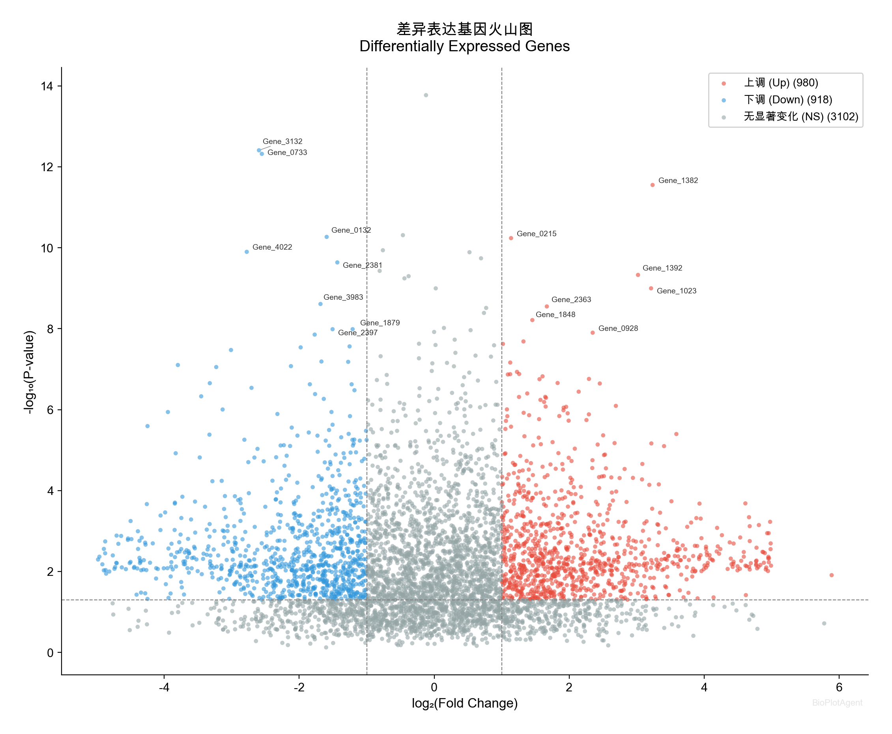
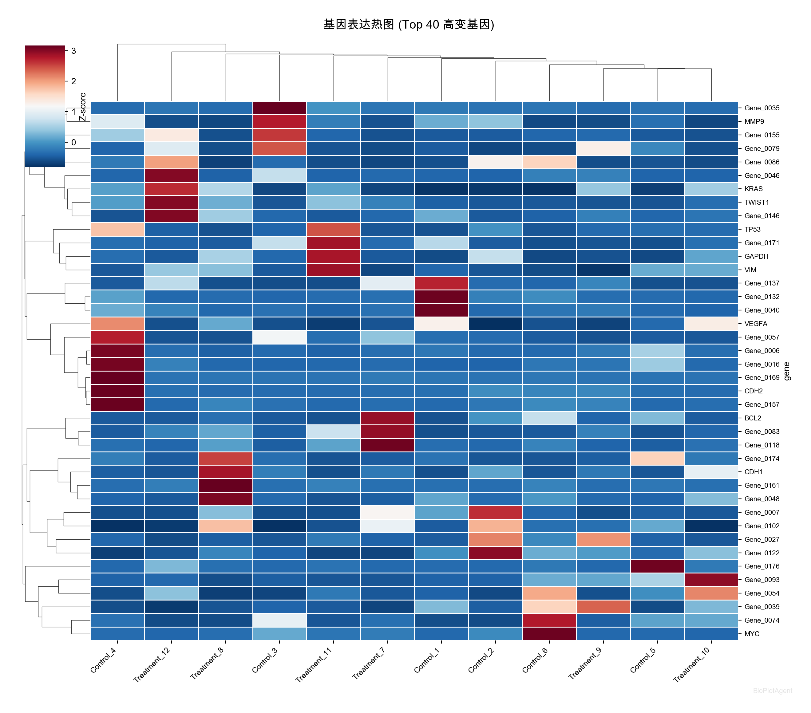
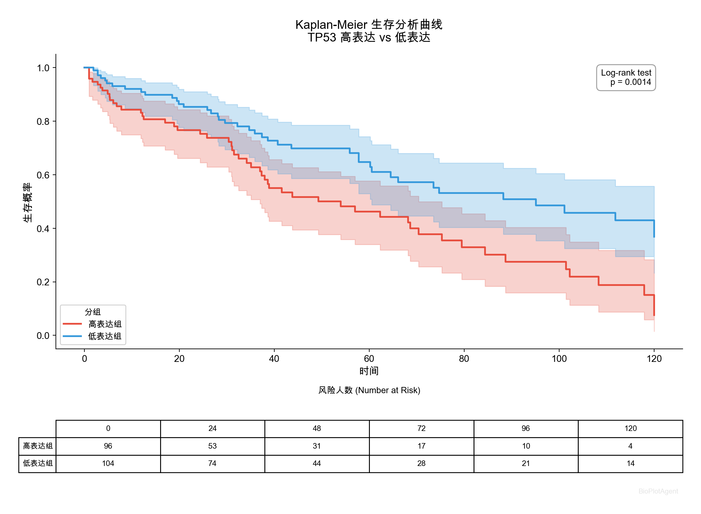
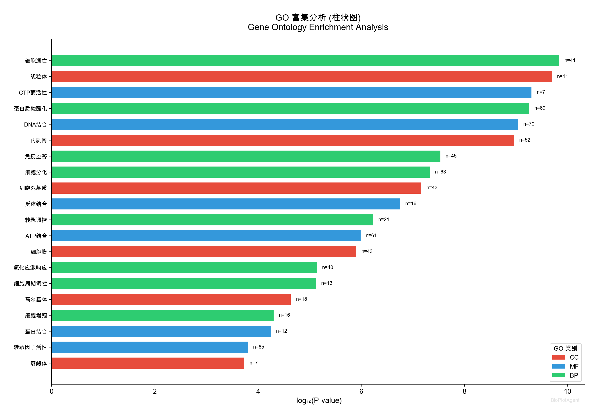
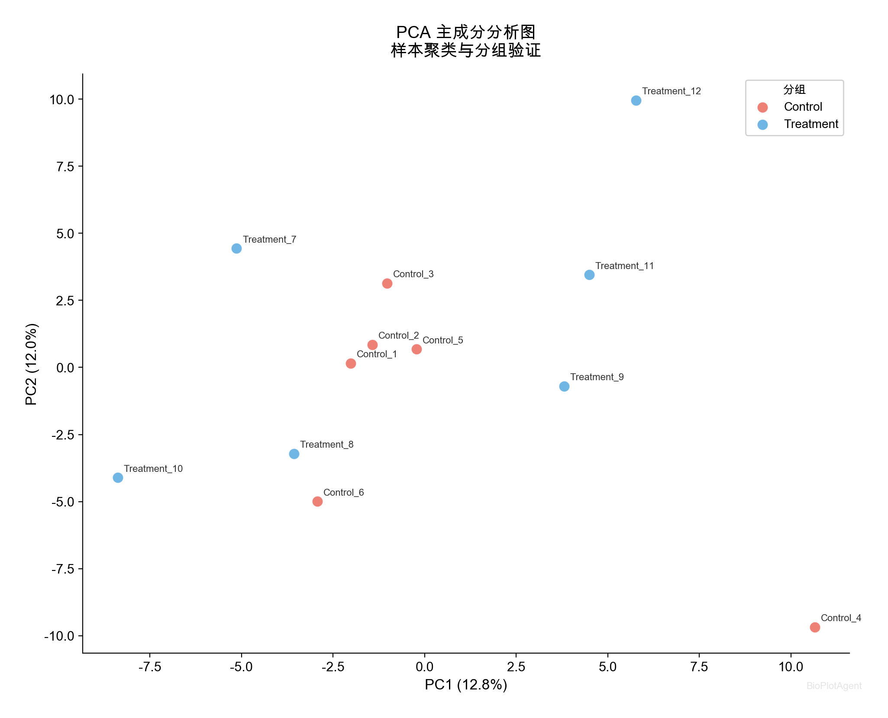
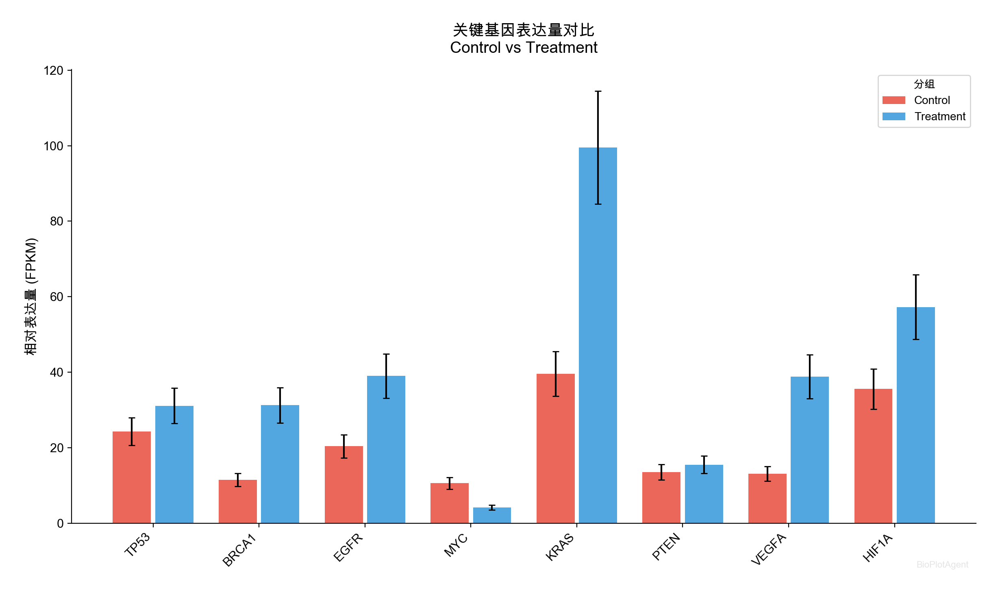
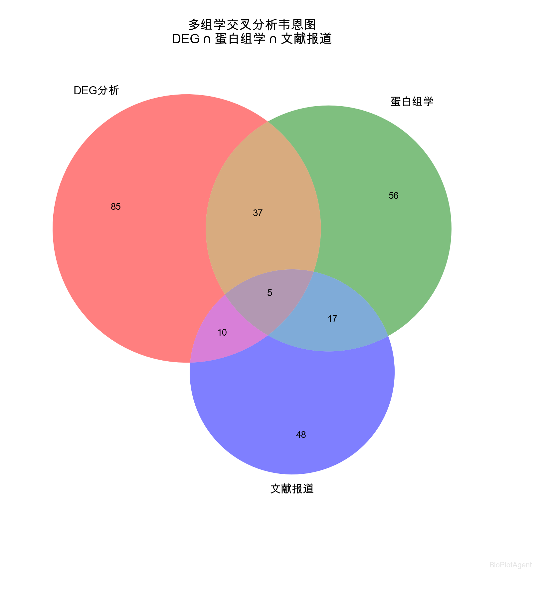

# 🧬 BioPlotAgent - 生物信息学智能绘图助手

> **让零基础用户也能绘制专业的生物信息学图表！**

BioPlotAgent 是一个基于 AI 的生物信息学可视化工具，集成了 **智能绘图**、**AI 对话** 和 **互动教学** 三大功能。无论你是刚接触生物信息学的小白，还是需要快速出图的研究者，都能轻松上手。

## 📸 效果展示

<p align="center">
  
  
</p>
<p align="center">
  
  
</p>
<p align="center">
  
  
  
</p>

## ✨ 核心功能

### 🎨 快速绘图模式
- 选择图表类型 → 上传数据 → 一键出图
- 支持 10 种常见生物信息学图表
- 自动识别数据格式，智能推荐参数
- 导出高清 PNG 和矢量 PDF

### 🤖 AI 助手模式
- 用自然语言描述你的需求
- AI 推荐最适合的图表类型
- 实时解答生物信息学问题
- 基于 MiniMax M2.7 大语言模型

### 📚 学习中心
- 每种图表都有详细的中文教程
- 用生活化的比喻解释专业概念
- "边学边练"的互动学习体验
- 从理解数据到解读结果的完整指导

## 📊 支持的图表类型

| 图表 | 说明 | 典型应用 |
|------|------|----------|
| 🌋 火山图 | 展示差异表达基因 | RNA-seq DEG 分析 |
| 🔥 热图 | 展示表达模式 | 基因表达谱聚类 |
| 📊 PCA图 | 样本差异降维展示 | 样本质控、批次效应 |
| 📈 生存曲线 | Kaplan-Meier 分析 | 预后分析、生物标志物 |
| 🧬 GO富集图 | 功能富集分析 | 差异基因功能注释 |
| 📊 柱状图 | 表达量对比 | RT-qPCR 验证 |
| 📦 箱线图 | 数据分布展示 | 组间差异比较 |
| ⭕ 韦恩图 | 集合重叠关系 | 多组学交叉分析 |
| 📉 MA Plot | 表达量与变化关系 | DESeq2 质控 |
| 🫧 气泡图 | 多维数据展示 | KEGG/GO 通路展示 |

## 🚀 快速开始

### 1. 克隆项目

```bash
git clone https://github.com/bcefghj/BioPlotAgent.git
cd BioPlotAgent
```

### 2. 安装依赖

```bash
pip install -r requirements.txt
```

### 3. 配置 API Key（AI 助手功能需要）

```bash
cp .env.example .env
# 编辑 .env 文件，填入你的 MiniMax API Key
```

> 💡 **快速绘图和学习中心不需要 API Key，可以直接使用！**

获取 API Key：访问 [MiniMax 开放平台](https://platform.minimax.io/)

### 4. 启动应用

```bash
streamlit run app.py
```

浏览器会自动打开 `http://localhost:8501`

## 📂 项目结构

```
BioPlotAgent/
├── app.py                    # Streamlit 主应用
├── config.py                 # 配置文件
├── requirements.txt          # Python 依赖
├── .env.example              # 环境变量模板
├── llm/                      # AI 模块
│   └── minimax_client.py     # MiniMax LLM 客户端
├── plotting/                 # 绘图模块
│   ├── volcano.py            # 火山图
│   ├── heatmap.py            # 热图
│   ├── pca.py                # PCA图
│   ├── survival.py           # 生存分析
│   ├── go_enrichment.py      # GO富集图
│   ├── bar_plot.py           # 柱状图
│   ├── box_plot.py           # 箱线图
│   ├── venn.py               # 韦恩图
│   ├── ma_plot.py            # MA Plot
│   ├── dot_plot.py           # 气泡图
│   └── utils.py              # 工具函数
├── data/
│   ├── examples/             # 示例数据集
│   └── generate_examples.py  # 数据生成脚本
└── tutorials/
    └── tutorial_content.py   # 教学内容
```

## 📋 数据格式说明

### 差异表达数据（火山图、MA Plot）

CSV 文件，包含以下列：
- `gene`：基因名称
- `log2FoldChange`：表达变化倍数
- `pvalue`：P值
- `baseMean`：平均表达量（MA Plot 需要）

### 表达矩阵（热图、PCA）

CSV 文件，第一列为基因名，其余列为各样本的表达值。

### 生存数据

CSV 文件，包含以下列：
- `time`：生存时间
- `event`：事件状态（1=事件发生，0=删失）
- `group`：分组信息

### GO 富集数据

CSV 文件，包含以下列：
- `Term`：GO术语
- `PValue`：P值
- `Count`：基因数
- `Category`：GO类别（可选，BP/MF/CC）

## 🎓 适合人群

- 🔰 **生物信息学初学者**：通过学习中心了解各类图表
- 🧑‍🔬 **实验室研究人员**：快速将数据转化为发表级图表
- 🎓 **研究生**：边学边用，提升数据分析能力
- 👨‍🏫 **教师**：用作生物信息学教学辅助工具

## 🛠 技术栈

- **前端**：Streamlit
- **绘图**：Matplotlib、Seaborn、Plotly
- **AI**：MiniMax M2.7（OpenAI 兼容接口）
- **数据处理**：Pandas、NumPy、Scikit-learn
- **生存分析**：Lifelines

## 🤝 贡献

欢迎提交 Issue 和 Pull Request！

## 📄 开源协议

MIT License

## 🙏 致谢

- [MiniMax](https://platform.minimax.io/) - AI 模型支持
- [Streamlit](https://streamlit.io/) - Web 框架
- [PlotGDP](https://plotgdp.biogdp.com/) - 项目灵感来源
